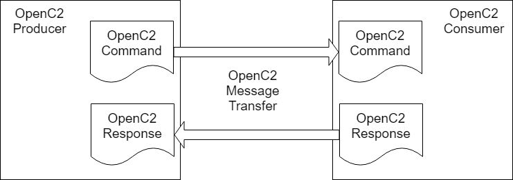
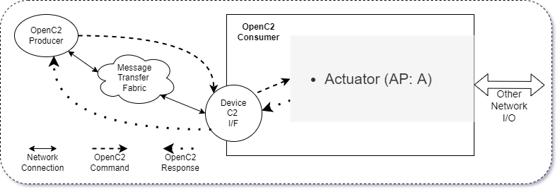
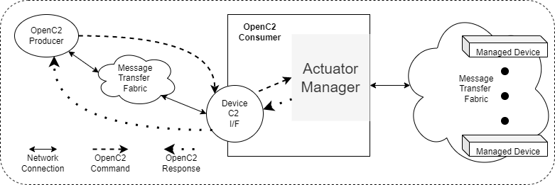
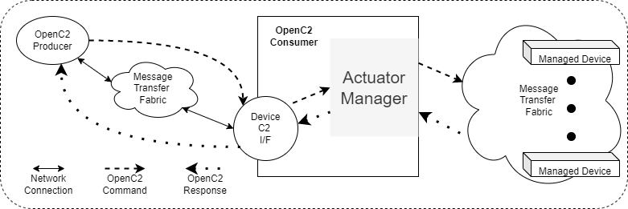
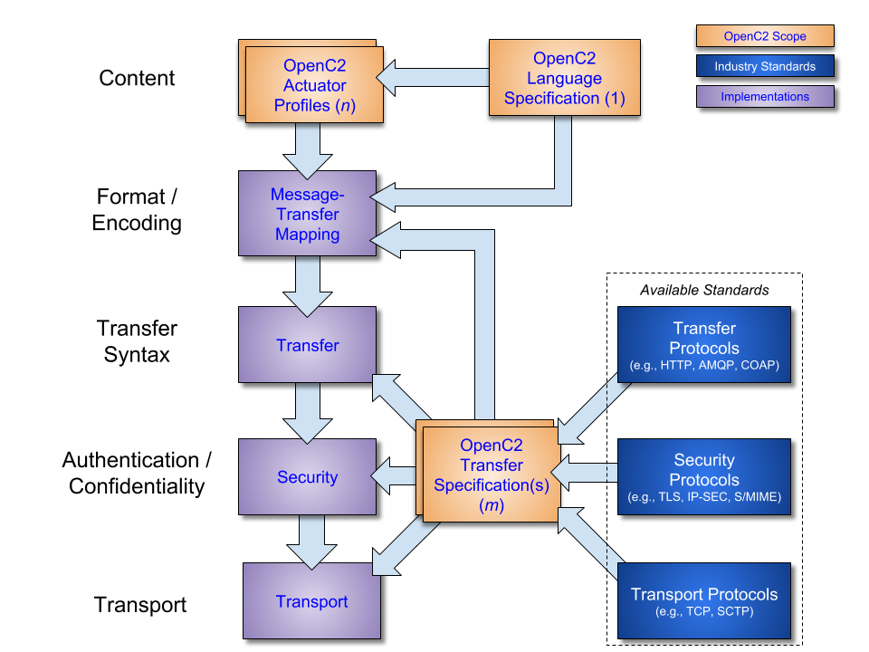
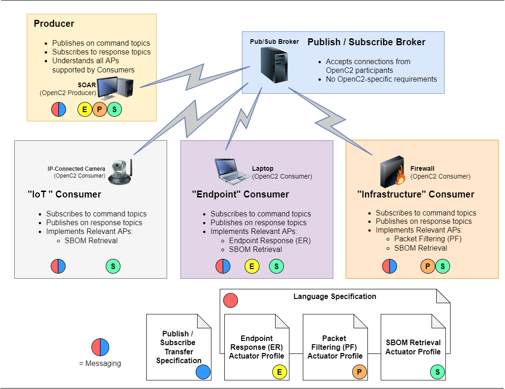

-------

# Open Command and Control (OpenC2) Architecture Specification Version 1.0

## Working Draft 05

## 11 May 2022

&nbsp;

<!-- URI list start (commented out except during publication by OASIS TC Admin)

#### This stage:
https://docs.oasis-open.org/openc2/oc2arch/v1.0/csd01/oc2arch-v1.0-csd01.md (Authoritative) \
https://docs.oasis-open.org/openc2/oc2arch/v1.0/csd01/oc2arch-v1.0-csd01.html \
https://docs.oasis-open.org/openc2/oc2arch/v1.0/csd01/oc2arch-v1.0-csd01.pdf

#### Previous stage:
N/A

#### Latest stage:
https://docs.oasis-open.org/openc2/oc2arch/v1.0/oc2arch-v1.0.md (Authoritative) \
https://docs.oasis-open.org/openc2/oc2arch/v1.0/oc2arch-v1.0.html \
https://docs.oasis-open.org/openc2/oc2arch/v1.0/oc2arch-v1.0.pdf

URI list end (commented out except during publication by OASIS TC Admin) -->

#### Technical Committee:
[OASIS Open Command and Control (OpenC2) TC](https://www.oasis-open.org/committees/openc2/)

#### Chair:
Duncan Sparrell (duncan@sfractal.com), [sFractal Consulting LLC](https://www.sfractal.com/) \
Michael Rosa (mjrosa@cyber.nsa.gov), [National Security Agency](https://www.nsa.gov/)

#### Editors:
Duncan Sparrell (duncan@sfractal.com), [sFractal Consulting LLC](http://www.sfractal.com/)

#### Additional artifacts:
This prose specification is one component of a Work Product that also includes:
* XML schemas: (list file names or directory name)
* Other parts (list titles and/or file names)
* `(Note: Any normative computer language definitions that are part of the Work Product, such as XML instances, schemas and Java(TM) code, including fragments of such, must be (a) well formed and valid, (b) provided in separate plain text files, (c) referenced from the Work Product; and (d) where any definition in these separate files disagrees with the definition found in the specification, the definition in the separate file prevails. Remove this note before submitting for publication.)`

#### Related work:
This specification is related to:
* _Open Command and Control (OpenC2) Language Specification Version 1.0_. Edited by Jason Romano and Duncan Sparrell. Latest stage: https://docs.oasis-open.org/openc2/oc2ls/v1.0/oc2ls-v1.0.html.

#### Abstract:
Cyberattacks are increasingly sophisticated, less expensive to execute, dynamic and automated. The provision of cyber defense via statically configured products operating in isolation is untenable. Standardized interfaces, protocols and data models will facilitate the integration of the functional blocks within a system and between systems. Open Command and Control (OpenC2) is a concise and extensible language to enable machine-to-machine communications for purposes of command and control of cyber defense components, subsystems and/or systems in a manner that is agnostic of the underlying products, technologies, transport mechanisms or other aspects of the implementation.

This document describes the abstract architecture of OpenC2 to define a common understanding of the messages and interactions for all bindings and serializations.

#### Status:
This document was last revised or approved by the OASIS Open Command and Control (OpenC2) TC on the above date. The level of approval is also listed above. Check the "Latest stage" location noted above for possible later revisions of this document. Any other numbered Versions and other technical work produced by the Technical Committee (TC) are listed at https://www.oasis-open.org/committees/tc_home.php?wg_abbrev=openc2#technical.

TC members should send comments on this specification to the TC's email list. Others should send comments to the TC's public comment list, after subscribing to it by following the instructions at the "[Send A Comment](https://www.oasis-open.org/committees/comments/index.php?wg_abbrev=)" button on the TC's web page at https://www.oasis-open.org/committees/openc2/.

This specification is provided under the [Non-Assertion](https://www.oasis-open.org/policies-guidelines/ipr#Non-Assertion-Mode) Mode of the OASIS IPR Policy, the mode chosen when the Technical Committee was established. For information on whether any patents have been disclosed that may be essential to implementing this specification, and any offers of patent licensing terms, please refer to the Intellectual Property Rights section of the TC's web page (https://www.oasis-open.org/committees/openc2/ipr.php).

Note that any machine-readable content ([Computer Language Definitions](https://www.oasis-open.org/policies-guidelines/tc-process#wpComponentsCompLang)) declared Normative for this Work Product is provided in separate plain text files. In the event of a discrepancy between any such plain text file and display content in the Work Product's prose narrative document(s), the content in the separate plain text file prevails.

#### Key words:
The key words "MUST", "MUST NOT", "REQUIRED", "SHALL", "SHALL NOT", "SHOULD", "SHOULD NOT", "RECOMMENDED", "NOT RECOMMENDED", "MAY", and "OPTIONAL" in this document are to be interpreted as described in BCP 14 [[RFC2119](#rfc2119)] and [[RFC8174](#rfc8174)] when, and only when, they appear in all capitals, as shown here.

#### Citation format:
When referencing this specification the following citation format should be used:

**[OpenC2-Arch-v1.0]**

_Open Command and Control (OpenC2) Architecture Specification Version 1.0_. Edited by Dan Johnson and Duncan Sparrell. 19 August 2021. OASIS Committee Specification Draft 01. https://docs.oasis-open.org/openc2/oc2arch/v1.0/csd01/oc2arch-v1.0-csd01.html. Latest stage: https://docs.oasis-open.org/openc2/oc2arch/v1.0/oc2arch-v1.0.html.

#### Notices
Copyright © OASIS Open 2021. All Rights Reserved.

Distributed under the terms of the OASIS [IPR Policy](https://www.oasis-open.org/policies-guidelines/ipr).

The name "OASIS" is a trademark of [OASIS](https://www.oasis-open.org/), the owner and developer of this specification, and should be used only to refer to the organization and its official outputs.

For complete copyright information please see the full Notices section in an Appendix below.

-------

# Table of Contents
- [1 Introduction](#1-introduction)
  - [1.1 Changes from earlier versions](#11-changes-from-earlier-versions)
  - [1.2 Goal](#12-goal)
  - [1.3 Glossary](#13-glossary)
    - [1.3.1 Definitions of terms](#131-definitions-of-terms)
    - [1.3.2 Acronyms and abbreviations](#132-acronyms-and-abbreviations)
- [2 OpenC2 Architecture](#2-openc2-architecture)
  - [2.1 Commands](#21-commands)
  - [2.2 Responses](#22-responses)
  - [2.3 Design Patterns](#23-design-patterns)
    - [2.3.1 Producers, Consumers, and Devices](#231-producers-consumers-and-devices)
      - [2.3.1.1 Single Function Device](#2311-single-function-device)
      - [2.3.1.2 Multiple Function Device](#2312-multiple-function-device)
      - [2.3.1.3 Actuator Manager Device](#2313-actuator-manager-device)
      - [2.3.1.4 Intermediate Consumer / Producer Device](#2314-intermediate-consumer--producer-device)
    - [2.3.2 Action-Target Model](#232-action-target-model)
    - [2.3.3 Introspection Model](#233-introspection-model)
  - [2.4 Implementations](#24-implementations)
- [3 Conformance](#3-conformance)
- [Appendix A. References](#appendix-a-references)
  - [A.1 Normative References](#a1-normative-references)
  - [A.2 Informative References](#a2-informative-references)
- [Appendix B. Safety, Security and Privacy Considerations](#appendix-b-safety-security-and-privacy-considerations)
  - [B.1 Overview](#b1-overview)
  - [B.2 Threats](#b2-threats)
  - [B.2.1 Threats to the Networks and Systems Being Defended](#b21-threats-to-the-networks-and-systems-being-defended)
    - [B.2.2 Threats to OpenC2 Traffic and Processing](#b22-threats-to-openc2-traffic-and-processing)
    - [B.2.3 Potential Attack Types](#b23-potential-attack-types)
  - [B.3 Security Services](#b3-security-services)
    - [B.3.1 Confidentiality](#b31-confidentiality)
    - [B.3.2 Integrity](#b32-integrity)
    - [B.3.3 Availability](#b33-availability)
    - [B.3.4 Authentication](#b34-authentication)
    - [B.3.5 Authorization And Access Control](#b35-authorization-and-access-control)
    - [B.3.6 Accountability](#b36-accountability)
    - [B.3.7 Non-Repudiation](#b37-non-repudiation)
    - [B.3.8 Auditing](#b38-auditing)
    - [B.3.9 Metrics Collection And Analysis](#b39-metrics-collection-and-analysis)
  - [B.4 Network Topologies](#b4-network-topologies)
    - [B.4.1 In-Band Cyber Defense C2](#b41-in-band-cyber-defense-c2)
    - [B.4.2 Out-Of-Band Cyber Defense C2](#b42-out-of-band-cyber-defense-c2)
- [Appendix C. Acknowledgments](#appendix-c-acknowledgments)
  - [C.1 Special Thanks](#c1-special-thanks)
  - [C.2 Participants](#c2-participants)
- [Appendix D. Revision History](#appendix-d-revision-history)
- [Appendix E. Examples](#appendix-e-examples)
  - [E.1 Application of Actuator Profiles and Transfer Specifications](#e1-application-of-actuator-profiles-and-transfer-specifications)
  - [E.2 Actuator Profile Typical Content](#e2-actuator-profile-typical-content)
  - [E.3 Transfer Specification Typical Content](#e3-transfer-specification-typical-content)
- [Appendix F. OpenC2 Namespace Registry](#appendix-f-openc2-namespace-registry)
  - [Namespace Concepts](#namespace-concepts)
  - [Registration Process](#registration-process)
- [Appendix G. Notices](#appendix-g-notices)

-------

# 1 Introduction

_The content in this section is non-normative, except where it is
marked normative._

OpenC2 is a suite of specifications that enables command and
control of cyber defense systems and components. OpenC2 typically
uses a request-response paradigm where a _Command_ is encoded by
a _Producer_ (managing application) and transferred to a
_Consumer_ (managed device or virtualized function) using a
secure transfer protocol, and the Consumer can respond with
status and any requested information.

OpenC2 allows the application producing the commands to discover
the set of capabilities supported by the managed devices. These
capabilities permit the managing application to adjust its
behavior to take advantage of the features exposed by the managed
device. The capability definitions can be easily extended in a
noncentralized manner, allowing standard and non-standard
capabilities to be defined with semantic and syntactic rigor.

OpenC2 is defined across a family of specifications of several types:

* The **OpenC2 Architecture Specification** (this document)
  describes the fundamental structures of OpenC2 and provides a
  blueprint for developing Actuator Profiles and Transfer
  Specifications.

* The **OpenC2 Language Specification** provides the semantics
 for the essential elements of the language, the structure for
  Commands and Responses, and the schema that defines the proper
  syntax for the language elements that represents the Command or
  Response. The Language Specification also defines the
  mechanisms for extending the OpenC2 language.
  [[OpenC2-Lang-v1.0]](#openc2-lang-v10)

* **OpenC2 Actuator Profiles** specify the subset of the OpenC2
  language relevant in the context of specific Actuator
  functions. Cyber defense components, devices, systems and/or
  instances may (in fact are likely to) implement multiple
  Actuator profiles. Actuator profiles extend the language by
  defining Specifiers that identify the Actuator to the required
  level of precision. Actuator Profiles may also define Command
  Arguments and Targets that are relevant and/or unique to those
  Actuator functions.

* **OpenC2 Transfer Specifications** utilize existing protocols
  and standards to implement OpenC2 message transfer in specific
  environments. These standards are used for communications and
  security functions beyond the scope of the language, such as
  message transfer encoding, authentication, and end-to-end
  transport of OpenC2 Messages.

The most common encoding of OpenC2 is in JSON and the most common
binding is to HTTP; this document assumes this encoding and
binding for all examples. Other encodings and bindings are
permitted and are defined in their respective documents.

## 1.1 Changes from earlier versions

* Reformatted to December 2020 OASIS work product template

## 1.2 Goal

OpenC2 is developing a language for interoperating between
functional elements of cyber defense systems. This language, used
in conjunction with OpenC2 Actuator Profiles and OpenC2 Transfer
Specifications, allows for vendor-agnostic cybertime response to
attacks.

The Integrated Adaptive Cyber Defense (IACD) framework defines a
collection of activities, based on the traditional OODA
(Observe–Orient–Decide–Act) Loop [[IACD]](#iacd):

* Sensing:  gathering of data regarding system activities
* Sense Making:  evaluating data using analytics to understand
  what's happening
* Decision Making:  determining a course-of-action to respond to
  system events
* Acting:  Executing the course-of-action

The goal of OpenC2 is to enable coordinated defense in
cyber-relevant time between decoupled blocks that perform cyber
defense functions. OpenC2 focuses on the Acting portion of the
IACD framework; the assumption that underlies the design of
OpenC2 is that the sensing/analytics have been provisioned and
the decision to act has been made. This goal and these
assumptions guide the design of OpenC2:

* **Technology Agnostic:**  The OpenC2 language defines a set of
  abstract atomic cyber defense actions in a platform- and
  implementation-agnostic manner

* **Concise:**  A Command is intended to convey only the
  essential information required to describe the action required
  and can be represented in a very compact form for
  communications-constrained environments

* **Abstract:**  Commands and Responses are defined abstractly
  and can be encoded and transferred via multiple schemes as
  dictated by the needs of different implementation environments

* **Extensible:**  While OpenC2 defines a core set of Actions and
  Targets for cyber defense, the language is expected to evolve
  with cyber defense technologies, and permits extensions to
  accommodate new cyber defense technologies.

The OpenC2 language assumes that the event has been detected, a
decision to act has been made, the act is warranted, and the
initiator and recipient of the Commands are authenticated and
authorized. The OpenC2 language was designed to be agnostic of
the other aspects of cyber defense implementations that realize
these assumptions.

## 1.3 Glossary

<!-- Optional section with suggested subsections -->

### 1.3.1 Definitions of terms

*This section is normative.*

-   **Action**: The task or activity to be performed (e.g., 'deny').

-   **Actuator**: The function performed by the Consumer that executes the
    Command (e.g., "Packet Filtering").

-   **Argument**: A property of a Command that provides additional information
    on how to perform the Command, such as date/time, periodicity, duration,
    etc.

-   **Command**: A Message defined by an Action-Target pair that is sent from a
    Producer and received by a Consumer.

-   **Consumer**: A managed device / application that receives Commands. Note
    that a single device / application can have both Consumer and Producer
    capabilities.

-   **Message**: A content- and transport-independent set of elements conveyed
    between Consumers and Producers.

-   **Producer**: A manager application that sends Commands.

-   **Request**: A Message from a Producer to a Consumer used to convey a
    Command.

-   **Response**: A Message from a Consumer to a Producer acknowledging a
    Command or returning the requested resources or status to a previously
    received Command.

-   **Specifier**: A property or field that identifies a Target or Actuator to
    some level of precision.

-   **Target**: The object of the Action, i.e., the Action is performed on the
    Target (e.g., IP Address).

### 1.3.2 Acronyms and abbreviations

| Acronym | Description |
|---------|----------------------------------------------------------------------|
| API     | Application Programming Interface |
| AP      | Actuator Profile |
| ASCII   | American Standard Code for Information Interchange |
| BCP     | Best Current Practice |
| CBOR    | Concise Binary Object Representation |
| CIDR    | Classless Inter-Domain Routing |
| CoAP    | Constrained Application Protocol |
| DOI     | Digital Object Identifier |
| ER      | Endpoint Response |
| EUI     | Extended Unique Identifier |
| HTTP    | Hyper Text Transfer Protocol |
| HTTPS   | Hyper Text Transfer Protocol Secure |
| IACD    | Integrated Adaptive Cyber Defense |
| IANA    | Internet Assigned Numbers Authority |
| ICMP    | Internet Control Message Protocol |
| ID      | Identifier |
| IP      | Internet Protocol |
| IoT     | Internet of Things |
| IPR     | Intellectual Property Rights |
| JSON    | JavaScript Object Notation |
| LS      | Language Specification | 
| MAC     | Media Access Control |
| MQTT    | Message Queuing Telemetry Transfer |
| OASIS   | Organization for the Advancement of Structured Information Standards |
| OODA    | Observe-Orient-Decide-Act |
| OpenC2  | Open Command and Control |
| OpenDXL | Open Data eXchange Layer |
| PDF     | Portable Document Format |
| RFC     | Request for Comment |
| SCTP    | Stream Control Transmission Protocol |
| SHA     | Security Hash Algorithm |
| SLPF    | StateLess Packet Filtering |
| STD     | Standard |
| TC      | Technical Committee |
| TCP     | Transmission Control Protocol |
| UDP     | User Datagram Control Protocol |
| UML     | Unified Modeling Language |
| URI     | Uniform Resource Identifier |
| UTC     | Coordinated Universal Time |
| UUID    | Universally Unique IDentifier |
| XML     | eXtensible Markup Language |


-------

# 2 OpenC2 Architecture

OpenC2 is a suite of specifications for Producers and Consumers
to command and execute cyber defense functions. These
specifications include the OpenC2 Language Specification,
Actuator Profiles (APs), and Transfer Specifications. The OpenC2
[Language Specification](#openc2-lang-v10) and Actuator Profile
specifications focus on the language content and meaning at the
Producer and Consumer level of Command and Response while the
transfer specifications focus on the protocols for their
exchange. The language is defined abstractly in the Language
Specification, permitting flexibility of message serialization
and transfer protocol choices when implementing OpenC2.
Interoperability between specific OpenC2 implementations is
dependent on the selection of common serialization and transfer
mechanisms.

In general, there are two types of participants involved in the
exchange of OpenC2 Messages, as depicted in Figure 2-1:

1. **Producers**: A Producer is an entity that creates and
   transmits Commands instructing one or more systems to execute
   Actions as specified in the Command. A Producer may receive
   and process Responses in conjunction with a Command.
2. **Consumers**: A Consumer is an entity that receives and may
   act upon a Command. A Consumer may create Responses that
   provide any information captured or necessary to send back to
   the Producer.

**Figure 2-1. OpenC2 Message Exchange**




The Language Specification defines two distinct content types
(i.e., payload structures): Command and Response.

## 2.1 Commands

**Command**: An instruction from one system, known as the
Producer, to one or more systems, the Consumer(s), to act on the
content of the Command.

The Command describes an Action to be performed on a Target and
may include information identifying the Actuator or Actuators
that are to execute the Command. A Command can also contain an
optional Command identifier, if necessary. The following list
summarizes the main four components of a Command.

* **Action** (required): The task or activity to be performed.
* **Target** (required): The object of the action. The Action is
  performed on the Target. Properties of the Target, called
  *Target Specifiers*, further identify the Target to some level of
  precision, such as one specific Target, a list of Targets, or a
  class of Targets.
* **Arguments** (optional): Provide additional information on how
  the command is to be performed, such as date/time, periodicity,
  duration, etc.
* **Actuator** (optional): The Actuator executes the Command. The
  Actuator will be defined within the context of an Actuator
  Profile. Properties of the Actuator, called *Actuator
  Specifiers*, further identify the Actuator to some level of
  precision, such as a specific Actuator, a list of Actuators, or
  a group of Actuators.

The Action and Target components are required. A particular
Target may be further refined by the Target type. The [Language
Specification](#openc2-lang-v10) defines procedures to extend the
set of OpenC2 Targets.

Command Arguments, if present, influence the Command by providing
information such as timing, periodicity, duration, or other
details on what is to be executed. They can also be used to
convey the need for acknowledgment or additional status
information about the execution of a Command.

An Actuator is an implementation of a cyber defense function that
executes the Command. An Actuator Profile is a specification that
identifies the subset of Actions, Targets and other aspects of
the OpenC2 language that are required or optional in the context
of a particular Actuator. An Actuator Profile also may extend the
language by defining additional Targets, Arguments, and Actuator
Specifiers that are meaningful and possibly unique to the
Actuator.

The Actuator is an optional component of a Command used to
clarify which Consumer(s) are the intended recipient(s). It
typically is not included in situations  where the identities of
the intended endpoints are unambiguous (e.g., defined by the
transfer mechanism). OpenC2 also provides for high-level
effects-based Commands, where an intermediate element receiving
the Command has discretion to define derivative Commands and
select appropriate Actuators to achieve the desired effect. The
Actuator component is usually omitted from an effects-based
Command.


## 2.2 Responses

 **Response**: Any information sent back to the Producer as a
 result of the Command.

The Response is sent from a Consumer, usually back to the
Producer, and is a means to provide information (such as
acknowledgment, status, etc.) regarding the results of executing
a Command.  At a minimum, a Response will contain a status code
to indicate the result of performing the Command. Additional
status text and response fields optionally provide more detailed
information that is specific to or requested by the Command.


## 2.3 Design Patterns

This section describes a number of OpenC2 concepts related to
creating working systems using OpenC2 specifications.

### 2.3.1 Producers, Consumers, and Devices

This section discusses four representative configurations for an
OpenC2 Consumer device:

1. The Consumer implements a single function, and therefore
   supports a Actuator Profile (AP).

1. The Consumer implements multiple functions, and therefore
   supports multiple APs, which may be all different, all the
   same, or a mixture.

1. The Consumer is a manager for a collection of devices,
   providing an indirect means for the Producer to use OpenC2
   Commands to influence the operations of those devices. The
   managed devices in the collection may or may not be identical,
   and the interface to them is not assumed to use OpenC2.

1. The Consumer is a manager for a collection of devices that are
   managed using OpenC2, making the device a combined Consumer /
   Producer.

In all of these configurations, "device" is a collective term for
the processing element that is the OpenC2 Consumer. A device
could be a physical or virtual entity in any number of computing
environments. The essential characteristics are that it is a
network-accessible, addressable entity that operates as an OpenC2
Consumer. 

In configurations 1 and 2, the Producer has direct, explicit
knowledge of the APs implemented by the Consumer.  OpenC2
Commands issued by the Producer directly affect the operation of
the Consumer device.

In configurations 3 and 4, the Producer has knowledge of the
capabilities supported by the Consumer manager, but only
indirectly affect the operation of the managed devices. In
configuration 3 there is no assumption that the interface between
the Consumer manager and the managed devices uses OpenC2 Commands
and Responses, whereas in configuration 4 that interface is
explictly OpenC2-based. Implementations with a mixture of OpenC2-
and non-OpenC2-based interactions with the managed devices are
also possible.

#### 2.3.1.1 Single Function Device

Figure 2-2 illustrates the situation with a Producer commanding
an OpenC2 Consumer that implements a single cybersecurity
function, and its corresponding AP. 

**Figure 2-2. Single Function Device**


#### 2.3.1.2 Multiple Function Device

Figure 2-3 illustrates the situation with a Producer commanding
an OpenC2 Consumer that implements multiple cybersecurity
function, and their corresponding APs. The cybersecurity
functions may be all different, all the same, or a mixture. An
example of different functions could be an end-user computer
system with anti-virus (AV), endpoint response (ER) and packet
filtering (PF) capabilities. An example of multiple instances of
the same AP in configuration 2 would be packet filtering
functions on multiple, distinct network interfaces.

**Figure 2-3. Multiple Function Device**


#### 2.3.1.3 Actuator Manager Device

Figure 2-4 illustrates the situation where the Consumer fronts a
set of managed devices implementing cybersecurity functions. The
managed devices may implement any mixture of cybersecurity
functions, and the Actuator Manager's interface to those devices
is not using OpenC2.

**Figure 2-4. Actuator Manager Device**


#### 2.3.1.4 Intermediate Consumer / Producer Device

Figure 2-5 illustrates the situation where the Consumer fronts a
set of managed devices implementing cybersecurity functions. The
managed devices may implement any mixture of cybersecurity
functions, but in this case the Manager's interface to those
devices explicitly does use OpenC2, making the device an
intermediate, combined Consumer / Producer.

**Figure 2-5. Actuator Manager Device Using OpenC2**


### 2.3.2 Action-Target Model

The OpenC2 Language Specification defines a standard set of
actions and a baseline collection of targets for those actions.
An action-target pair defines a command, as described in [Section
2.1](#21-commands).

The available set of actions for creating OpenC2 commands is
limited to those defined in the Language Specification in order
to encourage commonality and interoperability of implementations.
The function of each action is defined in the Language
Specification, and the set of actions can only be expanded by
modifying the Language Specification. 

In contrast the baseline set of targets in the Language
Specification is a usable set, but is also explicitly extensible.
This recognizes the diversity of cybersecurity functions and the
corresponding need for function-specific targets beyond the
general purpose set provided in the Language Specification.

There are other automation capabilities (e.g, Microsoft
Powershell) that implement a verb-noun model similar to that used
by OpenC2. Future expansions to the OpenC2 action set should take
advantage of prior work from similar capabilities in selecting
names for actions. This will encourage commonality of usage and
understanding of verbs in automation systems.

### 2.3.3 Introspection Model

A common situation in OpenC2 interactions is the need for a
Producer to determine the capabilities of a Consumer in order to
scope the range of commands that can usefully be sent to that
Consumer. The approach is demonstrated in the Language
Specification's provision of the `"query" : "features"` and
`"query" : "profiles"` commands. This "introspection" capability,
defined for OpenC2 as the ability of a Consumer to inform a
Producer of the Consumer's capabilities, enables a degree of
flexible self-configuration of the interactions between Producers
and Consumers. 

Any situation where a Consumer may potentially provide a range of
responses to a Producer's command is a candidate to apply the
introspection technique. For example, where a Consumer may return
a response in any of several data formats or serializations, it
is appropriate to consider a two-stage interaction:

 - **Stage 1:** the Producer identifies the information of interest
   and queries regarding the Consumer's capabilities to provide
   that information. The Consumer responds with a list, possibly
   prioritized, of the ways it can supply the required
   information.

 - **Stage 2:** the Producer selects from among the options provided
   by the Consumer and sends a Command specifying the desired
   packaging of the information. The Consumer responds with the
   required information packaged as specified.

The information provided by the Consumer in stage 1 enables the
Producer to proceed with confidence about the outcome of the
interaction in stage 2.

## 2.4 Implementations

OpenC2 implementations integrate the OpenC2 specifications
described above with related industry specifications, protocols,
and standards. Figure 2-3 depicts the relationships among the
family of OpenC2 specifications, and their relationships to other
industry standards and environment-specific implementations of
OpenC2. Note that the layering of implementation aspects in the
diagram is notional, and not intended to preclude any particular
approach to implementing the needed functionality (for example,
the use of an application-layer message signature function to
provide message source authentication and integrity).


**Figure 2-3. OpenC2 Documentation and Layering Model**


OpenC2 is conceptually partitioned into four layers as described
in Table 2-1.

**Table 2-1. OpenC2 Protocol Layers**

| Layer | Examples |
| :--- | :--- |
| Function-Specific Content | Actuator Profiles<br>([OpenC2-SLPF-v1.0](#openc2-slpf-v10), ...) |
| Common Content | Language Specification |
| Message | Transfer Specifications<br>([OpenC2-HTTPS-v1.0](#openc2-https-v10), [OpenC2-MQTT-v1.0](#openc2-mqtt-v10), ...) |
| Secure Transport | HTTPS, CoAP, MQTT, OpenDXL, ... |

* The **Secure Transport** layer provides a communication path
  between the Producer and the Consumer. OpenC2 can be layered
  over any standard transport protocol.
* The **Message** layer provides a transfer- and
  content-independent mechanism for conveying Messages. A
  transfer specification maps transfer-specific protocol elements
  to a transfer-independent set of message elements consisting of
  content and associated metadata.
* The **Common Content** layer defines the structure of Commands
  and Responses and a set of common language elements used to
  construct them.
* The **Function-specific Content** layer defines the language
  elements used to support a particular cyber defense function.
  An Actuator profile defines the implementation conformance
  requirements for that function. Producers and Consumers will
  support one or more profiles.


-------

# 3 Conformance
<!-- Required section -->

(Note: The [OASIS TC Process](https://www.oasis-open.org/policies-guidelines/tc-process#wpComponentsConfClause) requires that a specification approved by the TC at the Committee Specification Public Review Draft, Committee Specification or OASIS Standard level must include a separate section, listing a set of numbered conformance clauses, to which any implementation of the specification must adhere in order to claim conformance to the specification (or any optional portion thereof). This is done by listing the conformance clauses here.
For the definition of "conformance clause," see [OASIS Defined Terms](https://www.oasis-open.org/policies-guidelines/oasis-defined-terms-2017-05-26#dConformanceClause).

See "Guidelines to Writing Conformance Clauses":  
http://docs.oasis-open.org/templates/TCHandbook/ConformanceGuidelines.html.

Remove this note before submitting for publication.)

This section defines the conformance requirements for OpenC2 implementations.

## 3.1 Conformance-Related Definitions

An OpenC2 *Producer* is defined per Section 2 of this document.

An OpenC2 *Consumer* is defined per Section 2 of this document.

The OpenC2 *Transfer Specification List* is defined as:
- oc2-https
- oc2-mqtt

The OpenC2 *Actuator Profile Specification List* is defined as:
- slpf
- pf [Editor's note - remove if perchance arch goes for approval prior to ]
- sbom [Editor's note - remove if perchance arch goes for approval prior to ]
- endp  [Editor's note - remove if perchance arch goes for approval prior to ]
- sdnc [Editor's note - remove if perchance arch goes for approval prior to ]
- emgw [Editor's note - remove if perchance arch goes for approval prior to ]
- ids  [Editor's note - remove if perchance arch goes for approval prior to ]
- ips  [Editor's note - remove if perchance arch goes for approval prior to ]
- dlp  [Editor's note - remove if perchance arch goes for approval prior to ]
- swg [Editor's note - remove if perchance arch goes for approval prior to ]

The *Actuator Profile List* is defined as the list of Actuator
Profiles supported by the Consumer as supplied in the response to
the command:

```
{action:query, target:features, target-specifier:[profiles]}
```

as per Section 4.1 of the Language Specification.

A Consumer's *Actuator Profile List* is composed of two types of
profiles: 
 - Standard Actuator Profiles (SAP); i.e., those on the OpenC2
Actuator Profile Specification List; and 
 - Custom Actuator Profiles (CAP); i.e., those not on the OpenC2
Actuator Profile Specification List.

## 3.2 OpenC2 Producer Conformance Clauses

CC 3.2.1 In order to conform to this specification, an OpenC2
Producer MUST only issue OpenC2 commands conforming to OpenC2
Language Specification Section 5.1 Conformance Clause 1.

CC 3.2.2 In order to conform to this specification, an OpenC2
Producer MUST only accept responses conforming to OpenC2 Language
Specification Section 5.2 Conformance Clause 2.

CC 3.2.3 In order to conform to this specification, an OpenC2
Producer MUST be conformant to OpenC2 Language Specification
Section 5.3 Conformance Clause 3.

CC 3.2.4 In order to conform to this specification, an OpenC2
Producer MUST be conformant with at least one transfer
specification in the OpenC2 Transfer Specification List.

## 3.3 OpenC2 Consumer Conformance Clauses

CC 3.3.1 In order to conform to this specification, an OpenC2
Consumer MUST only accept OpenC2 commands conforming to OpenC2
Language Specification Section 5.1 Conformance Clause 1.

CC 3.3.2 In order to conform to this specification, an OpenC2
Consumer MUST only return responses conforming to OpenC2 Language
Specification Section 5.2 Conformance Clause 2.

CC 3.3.3 In order to conform to this specification, an OpenC2
Consumer MUST be conformant to OpenC2 Language Specification
Section 5.4 Conformance Clause 4.

CC 3.3.4 In order to conform to this specification, an OpenC2
Consumer MUST be conformant with at least one transfer
specification in the OpenC2 Transfer Specification List.

CC 3.3.5 In order to conform to this specification, an OpenC2
Consumer MUST have an OpenC2 Consumer Actuator Profile List with
at least one entry.

CC 3.3.6 In order to conform to this specification, all SAP
entries on a Consumer's OpenC2 Consumer Actuator Profile List
MUST conform to the corresponding OASIS OpenC2 Actuator Profiles.

CC 3.3.7 In order to conform to this specification, CAP MUST
extend the functionality covered by a profile on the OpenC2
Actuator Profile Specification List, but MUST conform with the
OpenC2 Actuator Profile Specification being extended. E.g if
slpf, Consumer must conform to OASIS OpenC2 SLPF Actuator Profile
Spec. Note if the actuator function is not an extension to an
existing function, fails this conformance clause. E.g. a CAP
fails this clause is it is for malware detection, and there is
not a malware detection SAP.

CC 3.3.8 In order to conform to this specification, all CAP
entries MUST [Editor's note - need words on how to define doing
extensions in standard way, probably referring to language spec
section]


-------

# Appendix A. References

<!-- Required section -->

This appendix contains the normative and informative references that are used in this document.

While any hyperlinks included in this appendix were valid at the time of publication, OASIS cannot guarantee their long-term validity.

## A.1 Normative References

The following documents are referenced in such a way that some or all of their content constitutes requirements of this document.


###### [OpenC2-Lang-v1.0]
_Open Command and Control (OpenC2) Language Specification Version 1.0_. Edited by Jason Romano and Duncan Sparrell. Latest stage: https://docs.oasis-open.org/openc2/oc2ls/v1.0/oc2ls-v1.0.html

###### [OpenC2-HTTPS-v1.1]
_Specification for Transfer of OpenC2 Messages via HTTPS Version 1.1_. Edited by David Lemire. Latest stage: https://docs.oasis-open.org/openc2/open-impl-https/v1.1/open-impl-https-v1.1.html

###### [OpenC2-MQTT-v1.0]
_Specification for Transfer of OpenC2 Messages via MQTT Version 1.0_. Edited by David Lemire. Latest stage: https://docs.oasis-open.org/openc2/transf-mqtt/v1.0/transf-mqtt-v1.0.html

###### [OpenC2-SLPF-v1.0]
_Open Command and Control (OpenC2) Profile for Stateless Packet Filtering Version 1.0_. Edited by Joe Brule, Duncan Sparrell, and Alex Everett. Latest stage: https://docs.oasis-open.org/openc2/oc2slpf/v1.0/oc2slpf-v1.0.html

###### [RFC2119]
Bradner, S., "Key words for use in RFCs to Indicate Requirement Levels", BCP 14, RFC 2119, DOI 10.17487/RFC2119, March 1997, http://www.rfc-editor.org/info/rfc2119.

###### [RFC8174]
Leiba, B., "Ambiguity of Uppercase vs Lowercase in RFC 2119 Key Words", BCP 14, RFC 8174, DOI 10.17487/RFC8174, May 2017, http://www.rfc-editor.org/info/rfc8174.

## A.2 Informative References

###### [IACD]
M. J. Herring, K. D. Willett, "Active Cyber Defense: A Vision for Real-Time Cyber Defense," Journal of Information Warfare, vol. 13, Issue 2, p. 80, April 2014.<https://www.semanticscholar.org/paper/Active-Cyber-Defense-%3A-A-Vision-for-Real-Time-Cyber-Herring-Willett/7c128468ae42584f282578b86439dbe9e8c904a8>.<br><br>Willett, Keith D., "Integrated Adaptive Cyberspace Defense: Secure Orchestration", International Command and Control Research and Technology Symposium, June 2015 <https://www.semanticscholar.org/paper/Integrated-Adaptive-Cyberspace-Defense-%3A-Secure-by-Willett/a22881b8a046e7eab11acf647d530c2a3b03b762>.


###### [RFC3552]
Rescorla, E. and B. Korver, "Guidelines for Writing RFC Text on Security Considerations", BCP 72, RFC 3552, DOI 10.17487/RFC3552, July 2003, https://www.rfc-editor.org/info/rfc3552.

-------

# Appendix B. Safety, Security and Privacy Considerations

<!-- Optional section -->

(Note: OASIS strongly recommends that Technical Committees consider issues that might affect safety, security, privacy, and/or data protection in implementations of their specification and document them for implementers and adopters. For some purposes, you may find it required, e.g. if you apply for IANA registration.

While it may not be immediately obvious how your specification might make systems vulnerable to attack, most specifications, because they involve communications between systems, message formats, or system settings, open potential channels for exploit. For example, IETF [[RFC3552](#rfc3552)] lists “eavesdropping, replay, message insertion, deletion, modification, and man-in-the-middle” as well as potential denial of service attacks as threats that must be considered and, if appropriate, addressed in IETF RFCs.

In addition to considering and describing foreseeable risks, this section should include guidance on how implementers and adopters can protect against these risks.

We encourage editors and TC members concerned with this subject to read _Guidelines for Writing RFC Text on Security Considerations_, IETF [[RFC3552](#rfc3552)], for more information.

Remove this note before submitting for publication.)

This appendix discusses security concerns related to OpenC2.

## B.1 Overview

Cyber defense systems are high-value targets for an attacker
since disabling detection and response capabilities opens the
door to allow further attacks. There would be great value to an
attacker to turn off the sensors, breach the defenses, disable
responsive actions, and potentially use the cyber defense tools
to attack the network.

## B.2 Threats

There are two threat target areas to address when considering the
security of OpenC2:  

1. Threats to and attacks on the user networks/systems being
defended, and 
1. Attacks directed at OpenC2 itself.  

## B.2.1 Threats to the Networks and Systems Being Defended

By providing the C2 for time-critical response actions OpenC2 is
an enabler of improved cyber defense capabilities for user
networks and systems. However, to the extent that OpenC2 traffic
and processing share resources with those user networks and
systems, those same threats (and mitigations) will also be
applicable to OpenC2. Even if the OpenC2 traffic is segregated
using logical or cryptographic separation, the underlying
physical resources may still be subject to common attacks (and
other threats) that will affect OpenC2 operations.

### B.2.2 Threats to OpenC2 Traffic and Processing

The threats, attacks, vulnerabilities, and impacts to a given
OpenC2 implementation should be analyzed with a focus on the
goals of the attacker and the resulting impacts since these will
be different from a standard user analysis.  Four categories of
threat sources should be addressed:

 * *Malicious Adversaries* (external or insider) – the primary
   source of concern for the security of OpenC2 operations

 * *Non-malicious Users* – mistakes by users, especially
   privileged users, can cause major lapses in cyber defense
   
 * *Structural Threats* – failures of hardware and/or software
   can affect network and system integrity or availability, and
   impede the ability of OpenC2 mechanisms to operate

 * *Environmental Threats* – disasters and infrastructure failures
   may need to addressed and accommodated depending on the
   mission needs of the defended networks

### B.2.3 Potential Attack Types

Malicious adversaries may use any form of attack, these are some
primary examples.

* *Passive Attacks* – An attacker may monitor traffic at levels
  of sophistication and access  ranging from simple traffic
  analysis (is there a change in the volume of OpenC2 traffic?)
  to eavesdropping on the contents of the messages (if
  unencrypted) to see what was detected, what actions are being
  taken, and the specific targets of OpenC2 commands.  This
  information will let the attacker know if their active attacks
  have been detected and how the system responds.  Their active
  attacks can then be revised to avoid detection or to trigger a
  known response.  In the latter case, the attacker could use
  knowledge of the response strategy to cause the system to
  unnecessarily deny services to users.

* *Active Attacks, Externally Initiated* – An attacker may try to
  manipulate the OpenC2 traffic by deleting, delaying, or
  replaying legitimate messages.  They may also attempt to modify
  the contents of a message or masquerade as an OpenC2 manager
  and issue bogus messages.  If any of these attacks succeed, the
  attacker can disrupt or disable responses to other attacks and
  can cause the defensive capabilities to impede legitimate
  operations.  Successfully subverting defenses can allow more
  intrusive attacks.

* *Insider Attacks* (Malicious users) – An insider, especially a
  privileged user, may be able to more effectively perform any of
  the passive and active attacks already mentioned plus can act
  as a legitimate user to perform other actions.  These actions
  could include misconfiguring devices, changing policy rules,
  issuing malicious commands from authorized sources, and even
  turning systems off.

* *Supply Chain or Distribution Attacks* - A vendor, transporter,
  developer, or installer may modify the software or hardware
  used for OpenC2-based functions.  The modification may
  introduce an exploitable vulnerability, disable a critical
  function, or cause failure under specific conditions.  Even if
  the attack is just substitution of a counterfeit component, the
  behavior may be different and cause problems.

## B.3 Security Services

This section reviews the applicability of traditional security
services to OpenC2 operations.

### B.3.1 Confidentiality

Confidentiality of OpenC2 message content prevents attackers from
seeing the response actions that result from attacker activities.
This knowledge could aid an attacker in manipulating or
circumventing cyber defenses. 

### B.3.2 Integrity

Both data and system integrity need to be addressed in OpenC2
implementations. Data integrity is extremely important - the
contents of a C2 message should not be modifiable without
detection.  Replay and re-sequencing attacks also need to be
addressed.  Message integrity must always be paired with source
authentication. System integrity including software/application
integrity is also critical to OpenC2 security.  If a system,
including system and application software, is not in a compliant,
stable configuration then its actions cannot be trusted.

### B.3.3 Availability

Availability in the context of OpenC2 is focused on the ability
of Producers to send commands to Consumers, and the corresponding
ability of Consumers to receive, execute, and send Responses to
those commands. Assuring availability can be very difficult if
the OpenC2 message traffic is carried in-band with the user
traffic. Out-of-band management networks should be used where
possible as they provide isolation of OpenC2 activities from
attacks against operational user networks and can be engineered
to provide better support for high availability. Also, approaches
to addressing intermittent connectivity and actions upon
reconnection should be addressed.


### B.3.4 Authentication

OpenC2 is envisioned for application in environments where C2
will be automated as much as possible.  In the consequent
machine-to-machine exchanges, the systems involved need to
securely authenticate that authorized systems are involved and
not rogue entities. In particular, actuators receiving and
executing OpenC2 commands must be able to confirm those commands
came from a source that can confidently be authenticated.  With
the increasing number of Internet-enabled devices, reliable
machine authentication is crucial to allow secure communication
in automated network environments. In any architecture
deployment, consider the appropriate levels and types of
authentication for managers and actuators.  

There are also aspects of identity and credential management that
need to be addressed:  uniqueness of name space, identification
of device type and instance, provisioning of credentials
(typically digital certificates), means to verify trust chain and
current status of credentials, means to revoke credentials, and
session management.  There are many challenges to find the right
authentication model that can support a machine-to-machine
communication method depending on the range of device and network
capabilities in the operating environment.

### B.3.5 Authorization And Access Control

Coupled with user or device authentication, a requesting entity
must have authorization before tasks are executed on its
direction. Authorization is the process of enforcing policies:
determining what types of actions on a resource or service are
permitted for this Producer.  Once a Producer has been
authenticated, they may be authorized for different types of
actions depending on the policy assigned.  The authorization
should be role- or attribute-based to avoid the problems of
maintaining an identity-based access control list.

The policy rules may include conditional aspects such as time of
day or operational status of network to prevent actions from
adversely affecting missions.  In these cases, it is important to
determine if the Producer has knowledge of the conditions and can
self-impose the policy rules or whether the policy needs to be
enforced at (or near) the resource.

### B.3.6 Accountability

Authentication is also the basis for associating the Producer
with the commands sent, the authorization decision (allow or
deny), and the actions taken.  The authenticated identity of the
actor along with the action is captured in the audit logs and
provides traceability to the responsible party.

### B.3.7 Non-Repudiation

Non-repudiation may be required if there is a requirement to
formally prove the issuance or receipt of a C2 message, however
any non-repudiation requirement should be evaluated critically
due to impacts on the processing, availability and delays of
automated cyber defense actions.  This level of security may not
be required in a closed system where source authentication and
logged receipt events are sufficient evidence of who sent and who
received messages.  Non-repudiation implementations may require a
third party acting as a notary or signature-based message
authentication resulting in additional costs in terms of
processing, communications, and invoking third-party services for
the commands and responses.  A time stamping service will
typically also be required.  The third party would timestamp
OpenC2 messages and certify proof of issuance and delivery.  This
will add dependencies and overhead to the system.

### B.3.8 Auditing

Audit trails are necessary in any secure system but have specific
considerations in machine-to-machine communications.  In
conjunction with appropriate tools and procedures, audit trails
can provide a means to help accomplish several security-related
objectives, including individual accountability, reconstruction
of events, intrusion detection, and problem identification.
Typical events include:

 * Authentication exchange between components (manager, actuator,
   and end points)
 * Message generated, message sent, message received
 * Action taken/allowed or request denied
 * Success or failure of any OpenC2 exchange
 * Configuration changes

Actions and the results that are invoked using OpenC2 should be
recorded and analyzed for security areas such as forensics,
secure implementation, security architecture of impact changes
within the environment, and completion of such tasks.  This type
of auditing provides the essential ingredients for early
detection of actions that violate security policy.

### B.3.9 Metrics Collection And Analysis

Collecting metrics will be necessary for a multitude of
activities to assess performance and improve effectiveness of
actions within an OpenC2 environment.  Implementations should
provide the ability to measure resources a user or system
component (e.g., sensors and actuators) consumes.  This could
include the amount of system time or quantity of messages it has
sent or received during a session.  This can be accomplished by
logging of session statistics and usage information and is used
for trend analysis, resource utilization, performance assessment,
and capacity planning.  Overall all of these are important data
captures to improve the configuration and deployment of OpenC2
components and a verification that operations are working as
intended.


## B.4 Network Topologies

The available networking architecture, topology, and technology
all have implications for, and may also be constrained by, OpenC2
use and security.  The topology and communications modes
supporting OpenC2 traffic will affect the ability and approaches
to achieving robustness, providing redundancy, and meeting
responsiveness goals. Ideally, OpenC2 traffic should be quickly
and reliably delivered to all intended recipients with some
guarantee or confirmation of both delivery and action taken. It
will not always be possible to achieve these goals due to
constraints of available or legacy networking and systems,
mobility/connectedness of devices, effects of attacks or outages
in the network, and management/cost factors.  

### B.4.1 In-Band Cyber Defense C2

If OpenC2 traffic is carried in-band with user and other traffic,
then it is subject to the same threats (plus the threats against
cyber defense C2) and will leverage the same defenses as the
other traffic. Besides being subject to the same external threats
as the other traffic, the implementer also needs to consider:

 * *Resource contention issues*: C2 traffic may be delayed or
   blocked by high volumes of user traffic or reductions in
   network capacity or connectivity

 * *Intended cyber defense actions*: The same blocking or filtering
   of traffic meant to stop an external attacker may affect C2
   traffic flow as well (e.g., external monitoring feeds could be
   cut off)
 * *Targeted attacks against cyber defense C2*: The attacker may
   specifically attempt to single out C2 traffic for intercept,
   modification, denial of service, or other attack

### B.4.2 Out-Of-Band Cyber Defense C2

Out-of-Band management involves the use of a dedicated channel
for managing network devices.  This allows the network operator
to establish trust boundaries in accessing the management
function to apply it to network resources.  It also can be used
to ensure management connectivity (including the ability to
determine the status of any network component) independent of the
status of in-band network components.  Out-of-Band Management
(OOBM) is a common best practice with renewed focus based on the
evolving threat landscape.  

C2 systems are prime objectives of adversaries and OOBM can
provide another layer in the defense-in-depth model.  The
effectiveness of this layering or separation depends on how OOBM
is implemented and secured.  There should be a much lower attack
surface since general users would not have access to this
channel.  Also security policies, generally, will restrict or
prohibit connection to the OOBM through access control lists or
other access methods.  In practice though, implementations may
have prioritized administrator access (including remote access)
and chosen weaker security.  For example, implementers may have
left back-door access in place so that disastrous failures can
rapidly be fixed.  To address these types of issues, a security
plan should be implemented and enforced, focusing in these areas,
which will enhance the entire security architecture of the
enterprise: 
 * Definitions of vulnerabilities and risks of out-of-band access
for OpenC2 
 * Review security architecture for mitigating those risks 
 * Proper balance between security and the need for timely
out-of-band access during critical events 
 * Systems of processes, equipment and technologies that provide,
wherever required for OpenC2 integrity, confidentiality, and/or
non-repudiation for out-of-band access.


-------

# Appendix C. Acknowledgments

<!-- Required section -->

Note: A Work Product approved by the TC must include a list of people who participated in the development of the Work Product. This is generally done by collecting the list of names in this appendix. This list shall be initially compiled by the Chair, and any Member of the TC may add or remove their names from the list by request. Remove this note before submitting for publication.

## C.1 Special Thanks

<!-- This is an optional subsection to call out contributions from TC members. If a TC wants to thank non-TC members then they should avoid using the term "contribution" and instead thank them for their "expertise" or "assistance". -->

Substantial contributions to this document from the following individuals are gratefully acknowledged:

Participant Name, Affiliation or "Individual Member"

## C.2 Participants

<!-- A TC can determine who they list here, however, TC Observers must not be listed. It is common practice for TCs to list everyone that was part of the TC during the creation of the document, but this is ultimately a TC decision on who they want to list and not list. -->

The following individuals have participated in the creation of this specification and are gratefully acknowledged:

**OpenC2 TC Members:**

| First Name | Last Name | Company |
| :--- | :--- | :--- |
Philippe | Alman | Something Networks
Alex | Amirnovman | Company B
Kris | Anderman | Mini Micro
Darren | Anstman | Big Networks

-------

# Appendix D. Revision History

<!-- Optional section -->

| Revision | Date | Editor | Changes Made |
| :--- | :--- | :--- | :--- |
| specname-v1.0-wd01 | yyyy-mm-dd | Editor Name | Initial working draft |

-------

# Appendix E. Examples

## E.1 Application of Actuator Profiles and Transfer Specifications

This example illustrates the application of the various types of
OpenC2 specifications. Figure E-1 shows a simple operating
environment with five components:

 - A Security Orchestration, Automation, and Response (SOAR)
   system that is the OpenC2 Producer in the environment,
   directing the operation of OpenC2-enabled cyber defense
   functions.
  
 - A Publish / Subscribe message broker to support communications
   among the other components.
  
 - Three OpenC2 Consumers:
   - An IP-Connected camera, illustrative of an Internet of
     Things (IoT) Consumer;
   - A Laptop, illustrative of a general purpose endpoint
     consumer;
   - A Firewall, illustrative of a network infrastructure
     consumer.

##### Figure E-1: Application of Actuator Profiles and Transfer Specifications


The diagram also shows a collection of OpenC2 specifications, and
tags the components with the specifications relevant to their
participation in OpenC2 exchanges:

 - The OpenC2 Language Specification
 - A Publish / Subscribe Transfer Specification
 - Three Actuator Profiles:
   - Endpoint Response (tagged "E")
   - Packet Filtering ("P")
   - Software Bill of Material (SBOM) Retrieval ("S")

Colored circles on each of the components identify which
specifications are relevant to that component:

 - The message broker needs to conform to the publish / subscribe
   protocol called out in the Transfer Specification, but does
   not have any OpenC2-specific requirements.

 - Messaging is defined by a combination of information from the
   Language Specification and the Transfer Specification,
   indicated by a bi-colored (red/blue) bubble. This function is
   relevant to all of the OpenC2 components.
 - All IP-connected camera must support the SBOM Retrieval AP.
 - The laptop (Endpoint Consumer) must support the SBOM Retrieval
   AP and the Endpoint Respose AP.
 - The firewall (Infrastructure Consumer) must support the SBOM
   Retrieval AP and the Packet Filtering AP.

## E.2 Actuator Profile Typical Content

This example provides an overview of the typical structure and
content of an OpenC2 Acuator Profile.

### 1.0 Introduction

This section provides a brief overview of the cyber defense
function addressed in this AP.

### 2.0 OpenC2 Language Binding

This section defines the set of Actions, Targets, Arguments, and
Actuator Specifiers that are meaningful in the context of PF and
the appropriate status codes, status texts, and other properties
of a Response message. This section is also where any AP-specific
extentions to the language are defined.

#### 2.1 OpenC2 Command Components

This section identifies the OpenC2 Actions, Targets, Arguments,
and Target and Actuator Specifiers needed for this AP. Depending
on the needs of the AP, extended targets, arguments, and
specifiers can be defined in this section.

#### 2.2 OpenC2 Response Components

This section defines common and unique responses neede for this
AP, and the response status codes that are applicable.

#### 2.3 OpenC2 Commands

This section defines the commands (i.e., Action / Target pairs)
used for the control of the cyber defense function. A matrix is
used to identify the valid pairs:

|          | action 1 | action 2 | action 3 | action 4 |
|:--------:|:--------:|:--------:|:--------:|:--------:|
| target A |          |   valid  |          |          |
| target B |   valid  |   valid  |          |          |
| target C |          |          |   valid  |   valid  |


A second table links the valid commands to the available
arguments, and links to the subsequent section where this command
is discussed in detail.

|            |   command 1   |   command 2   |   command 3   |   command 4   | command 5     |
|:----------:|:-------------:|:-------------:|:-------------:|:-------------:|---------------|
| argument 1 | section a.b.c |               | section a.b.e |               |               |
| argument 2 | section a.b.c | section a.b.d |               |               |               |
| argument 3 | section a.b.c |               |               | section a.b.f | section a.b.g |

Subsequent subsections provide needed details about each command
and its relevant arguments.

### 3.0 Conformance

This section provides the conformance clauses required in an
OASIS specification. Clauses are grouped into those applicable to
Producers using this AP to generate commands and those applicable
to Consumers receiving and executing those commands.

#### 3.1 Clauses Pertaining to the OpenC2 Producer Conformance Target

 - Baseline Producer Clauses
 - Specific Producer Clause 1
 - Specific Producer Clause 2
 - ...
 - Specific Producer Clause _n_


#### 3.2 Clauses Pertaining to the OpenC2 Consumer Conformance Target

 - Baseline Consumer Clauses
 - Specific Consumer Clause 1
 - Specific Consumer Clause 2
 - ...
 - Specific Consumer Clause _m_


### Appendix E. Examples

Examples of commands and responses that illustrate the use of
this AP will be found in Appendix E.


## E.3 Transfer Specification Typical Content


This example provides an overview of the typical structure and
content of an OpenC2 Transfer Specification.

### 1.0 Introduction

This section provides a brief introduction to the transfer
protocol that is the focus of this transfer specification.

### 2.0 Operating Model

This section provides an overview of the approach employed to use
the transfer protocols in support of OpenC2 messaging. A
description of how OpenC2 messages are packaged for transfer in
the protocol is needed. Other content of the section is flexible
based on the characteristics of the protocol in use. For example,
a subsection of 2.0 would describe the topic structure used in a
publish / subscribe environment, or which protocol features are
used in a specific way for OpenC2 messaging.

### 3.0 Protocol Mapping

This section defines specific requirements to use the transfer
protocol to implement the operating model, and provides details
as needed to apply the standard that describe the protocol.
Similar to section 2, the structure of this ection if flexible
based on the characteristics of the protocol in use.

### 4.0 Conformance

This section provides the conformance clauses required in an
OASIS specification.  Clauses may or may not be grouped into
those applicable to Producers and those applicable to Consumers
receiving and executing those commands, depending on the nature
of the protocol in use.


### Appendix E. Examples

Examples of message transfer that illustrate the use of this
transfer specifcation will be found in Appendix E.


-------

# Appendix F. OpenC2 Namespace Registry


## Namespace Concepts
A [namespace](https://en.wikipedia.org/wiki/Namespace) is a set
of names used to identify objects. A namespace ensures that all
of a given set of objects can be easily identified and
unambiguously referenced.

All OpenC2 type definitions are contained in a specification, and
each specification is assigned a globally-unique namespace in the
form of a URI.  Types in one specification can reference types
defined in another specification using a namespaced name:

    name = <namespace identifier> separator <local name>

The XML standard includes namespaces but JSON does not. Because
OpenC2 consists of multiple specifications, it requires a
namespacing mechanism usable with JSON data. OpenC2 has therefore
created a naming approach similar to XML's that can be applied to
non-namespaced data formats such as JSON.  For brevity the
approach assigns a short Namespace Identifier (NSID) to each
referenced namespace using an **import** statement, then uses the
NSID as a prefix to each referenced type:

**schema**:
```
import: {"ex": "http://www.example.com/datatypes/v1.2"}

Person = Record
    1 name   String
    2 id     Integer
    3 email  ex:Email-Address  // type definition imported/resolved from another specification
```
**JSON data**:
```
    {"name": "John", "id": 12345, "email": "john@acme.com"}
```
Namespacing thus involves four different values:
* **Namespace**: The unique identifier of a referenced
  specification: "http://www.example.com/datatypes/v1.2"
* **Type Name**: the name of a type defined in a referenced
  specification: "Email-Address"
* **NSID**: a short abbreviation for a Namespace used as a prefix
  with an imported type: "ex"
* **Field Name**: may be serialized as a JSON object property
  whose value is an imported type: "email"

This approach uses a resolver to look up all namespaced type
definitions from their defining specifications and incorporates
them into a single schema. Authors can manually copy and paste
definitions into a monolithic specification, but namespace
resolution automates that process, eliminating redundancy and the
potential for inconsistency.

A namespace URI is only an identifier. For syntactic reasons it
must have a scheme (http) but it is not a network-accessible
resource. Referenced specifications do not need to be available
online and implementations are not required to do namespace
resolution at runtime, although dynamic namespace resolution may
be appropriate for some use cases. URLs for online schemas should
be derived from the namespace using scheme "https", filename
"schema", and the applicable file extension: ".jadn" for the
abstract schema, and ".json", ".xsd", ".cddl", ".proto", etc. for
corresponding concrete schemas.

## Registration Process
OpenC2 TC work product names and shorthands are coordinated with
OASIS TC Administration during initial work product definition.
Namespace URIs are based on the shorthands from this
coordination, omitting the filename and the "docs" domain
component, and using "http" as the scheme component.

* **Actuator Profile Name**: ap-\<function-shorthand\> (e.g.,
  "av" for anti-virus)
* **Example Profile URL**:
  https://docs.oasis-open.org/openc2/ap-av/v1.0/ap-av-v1.0.html
* **Example Namespace**: http://oasis-open.org/openc2/ap-av/v1.0
* **Example Schema URL**:
  https://oasis-open.org/openc2/ap-av/v1.0/schema.jadn

Custom actuator profile namespaces are chosen by the profile
author and should be chosen to avoid conflict with namespace URIs
registered here. Custom profile authors may register Namespaces
under http://oasis-open.org/openc2/custom but are not required to
do so.


-------

# Appendix G. Notices

<!-- Required section. Do not modify. -->

Copyright © OASIS Open 2021. All Rights Reserved.

All capitalized terms in the following text have the meanings assigned to them in the OASIS Intellectual Property Rights Policy (the "OASIS IPR Policy"). The full [Policy](https://www.oasis-open.org/policies-guidelines/ipr) may be found at the OASIS website.

This document and translations of it may be copied and furnished to others, and derivative works that comment on or otherwise explain it or assist in its implementation may be prepared, copied, published, and distributed, in whole or in part, without restriction of any kind, provided that the above copyright notice and this section are included on all such copies and derivative works. However, this document itself may not be modified in any way, including by removing the copyright notice or references to OASIS, except as needed for the purpose of developing any document or deliverable produced by an OASIS Technical Committee (in which case the rules applicable to copyrights, as set forth in the OASIS IPR Policy, must be followed) or as required to translate it into languages other than English.

The limited permissions granted above are perpetual and will not be revoked by OASIS or its successors or assigns.

This document and the information contained herein is provided on an "AS IS" basis and OASIS DISCLAIMS ALL WARRANTIES, EXPRESS OR IMPLIED, INCLUDING BUT NOT LIMITED TO ANY WARRANTY THAT THE USE OF THE INFORMATION HEREIN WILL NOT INFRINGE ANY OWNERSHIP RIGHTS OR ANY IMPLIED WARRANTIES OF MERCHANTABILITY OR FITNESS FOR A PARTICULAR PURPOSE.

As stated in the OASIS IPR Policy, the following three paragraphs in brackets apply to OASIS Standards Final Deliverable documents (Committee Specification, Candidate OASIS Standard, OASIS Standard, or Approved Errata).

\[OASIS requests that any OASIS Party or any other party that believes it has patent claims that would necessarily be infringed by implementations of this OASIS Standards Final Deliverable, to notify OASIS TC Administrator and provide an indication of its willingness to grant patent licenses to such patent claims in a manner consistent with the IPR Mode of the OASIS Technical Committee that produced this deliverable.\]

\[OASIS invites any party to contact the OASIS TC Administrator if it is aware of a claim of ownership of any patent claims that would necessarily be infringed by implementations of this OASIS Standards Final Deliverable by a patent holder that is not willing to provide a license to such patent claims in a manner consistent with the IPR Mode of the OASIS Technical Committee that produced this OASIS Standards Final Deliverable. OASIS may include such claims on its website, but disclaims any obligation to do so.\]

\[OASIS takes no position regarding the validity or scope of any intellectual property or other rights that might be claimed to pertain to the implementation or use of the technology described in this OASIS Standards Final Deliverable or the extent to which any license under such rights might or might not be available; neither does it represent that it has made any effort to identify any such rights. Information on OASIS' procedures with respect to rights in any document or deliverable produced by an OASIS Technical Committee can be found on the OASIS website. Copies of claims of rights made available for publication and any assurances of licenses to be made available, or the result of an attempt made to obtain a general license or permission for the use of such proprietary rights by implementers or users of this OASIS Standards Final Deliverable, can be obtained from the OASIS TC Administrator. OASIS makes no representation that any information or list of intellectual property rights will at any time be complete, or that any claims in such list are, in fact, Essential Claims.\]

The name "OASIS" is a trademark of [OASIS](https://www.oasis-open.org/), the owner and developer of this specification, and should be used only to refer to the organization and its official outputs. OASIS welcomes reference to, and implementation and use of, specifications, while reserving the right to enforce its marks against misleading uses. Please see https://www.oasis-open.org/policies-guidelines/trademark for above guidance.
